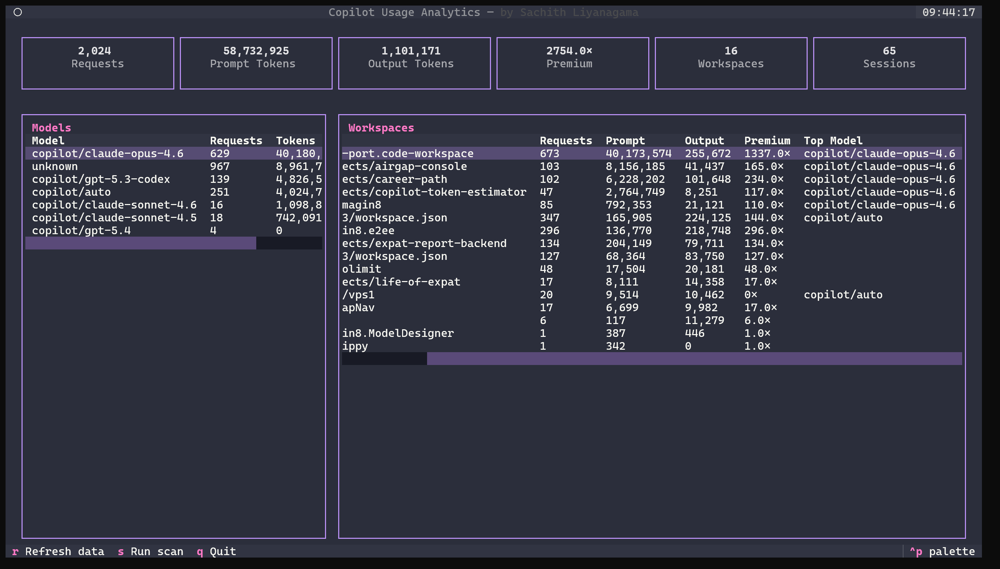

# Copilot Usage Analytics

[](https://pypi.org/project/copilot-usage/)
[](https://github.com/SachiHarshitha/copilot-usage/releases/latest)
[](https://pypi.org/project/copilot-usage/)
[](LICENSE)

A **local-first** analytics dashboard that parses your VS Code Copilot chat session data and visualises token usage, premium request estimates, and model distribution — all without sending any data externally.

## Why I Built This

I built this tool to make GitHub Copilot usage more transparent and actionable in real development work. Beyond showing token usage over time, it helps estimate and allocate AI costs at repository level — something that is difficult today when developers work across multiple systems in parallel. By turning persisted Copilot session data into a timeline tied to projects, the tool makes it easier to understand usage patterns, compare workflows, and assign clearer estimated costs to each repo.


## Features

- **Incremental scanning** — Only parses new or changed JSONL files on each run
- **DuckDB storage** — Fast local analytical database, no server required
- **Premium request estimation** — Calculates costs based on GitHub's model multiplier table
- **Multi-page dashboard** — Overview with KPI cards and charts, plus a detailed Explorer page with search & filters
- **Per-workspace breakdown** — See which projects use the most tokens
- **Model distribution** — Visualise usage across GPT-4o, Claude, Gemini, and other models
- **Badge export** — Shields.io-compatible JSON badges for each workspace
- **Cross-platform** — Windows, macOS, and Linux

## Quick Start

### Install

```bash
cd apps/cli
pip install -e .
```

### Run

```bash
# Scan data and launch dashboard (default)
copilot-usage

# Scan only (no dashboard)
copilot-usage analyze

# Dashboard only (skip scan)
copilot-usage dashboard
```

The dashboard opens automatically at [http://127.0.0.1:8050](http://127.0.0.1:8050).

### CLI Options

| Flag | Description |
|------|-------------|
| `--port PORT` | Dashboard port (default: 8050) |
| `--no-browser` | Don't auto-open browser |
| `-v, --verbose` | Enable debug logging |


### CLI & Terminal Dashboard

The tool ships with an interactive CLI powered by [Rich](https://github.com/Textualize/rich) and [InquirerPy](https://github.com/kazhala/InquirerPy). When launched without arguments, you get an arrow-key menu to scan, launch the web dashboard, open the terminal dashboard, or adjust settings — all without leaving the terminal.

A full **terminal UI dashboard** built with [Textual](https://github.com/Textualize/textual) shows KPIs, model breakdown, and workspace stats directly in the console. Press `S` to trigger a scan, `R` to refresh, and `Q` to quit.

```bash
# Interactive mode (arrow-key menu)
copilot-usage

# Launch terminal dashboard directly
copilot-usage tui
```




## Web Dashboard

The web dashboard is a multi-page [Plotly Dash](https://dash.plotly.com/) application served locally. It provides interactive charts, filterable tables, and real-time pipeline controls — all rendered in the browser with no external dependencies or data leaving your machine.

### Overview

The main page shows at-a-glance KPI cards, a daily token timeline chart, model distribution pie chart, and summary tables for workspaces and sessions.

### Explorer

A dedicated search & filter page where you can:

- **Search** by session ID, workspace, or model name
- **Filter** by date range, workspace, model, and minimum token count
- **Sort** results by any column
- Browse the full event-level detail


### Pipeline

Run the data ingestion pipeline directly from the dashboard with a real-time console output.


### Badges

Generate Shields.io-compatible JSON badges for your workspaces.


### Settings

Manage appearance (dark/light theme toggle), view system info, and erase the database.


## How It Works

1. **Discovery** — Finds all `chatSessions/*.jsonl` files in VS Code workspace storage
2. **Parsing** — Extracts session anchors, request metadata, and token counts from JSONL events
3. **Ingestion** — Writes structured events to a local DuckDB database with premium cost estimates
4. **Aggregation** — Pre-computes daily, per-session, and per-workspace summaries
5. **Dashboard** — Plotly Dash serves interactive charts and tables from the local database

## Data Source

The tool reads from VS Code's local storage:

| Platform | Path |
|----------|------|
| Windows | `%APPDATA%\Code\User\workspaceStorage\` |
| macOS | `~/Library/Application Support/Code/User/workspaceStorage/` |
| Linux | `~/.config/Code/User/workspaceStorage/` |

**No data leaves your machine.** Everything is processed and stored locally.

## Database

DuckDB database is stored at:

| Platform | Path |
|----------|------|
| Windows | `%LOCALAPPDATA%\copilot-usage\copilot_usage.duckdb` |
| macOS | `~/Library/Application Support/copilot-usage/copilot_usage.duckdb` |
| Linux | `~/.local/share/copilot-usage/copilot_usage.duckdb` |

## Model Multipliers

Premium request estimates use GitHub's published multiplier table:

| Model | Multiplier |
|-------|-----------|
| GPT-4.1, GPT-4o, Claude Sonnet 4, Gemini 2.5 Flash | 0× (included) |
| O4-mini, Gemini 2.5 Pro, Claude Sonnet 4 Thinking | 1× |
| Claude Opus 4.6, O3 | 3× |

## Project Structure

```
copilot-usage/
├─ apps/
│  ├─ cli/                        # Python CLI + Dash dashboard (PyPI package)
│  │  ├─ src/copilot_usage/
│  │  │  ├── __main__.py         # CLI entrypoint (interactive + classic)
│  │  │  ├── config.py           # Paths, model multipliers
│  │  │  ├── db.py               # DuckDB schema & connection
│  │  │  ├── discovery.py        # JSONL file discovery
│  │  │  ├── parser.py           # JSONL parsing
│  │  │  ├── ingest.py           # Event ingestion
│  │  │  ├── aggregator.py       # Pre-aggregation
│  │  │  ├── pipeline.py         # Scan orchestrator
│  │  │  ├── badges.py           # Shields.io badge export
│  │  │  ├── logging.py          # Loguru logging config
│  │  │  ├── tui.py              # Textual terminal dashboard
│  │  │  └── dashboard/
│  │  │      ├── app.py          # Dash multi-page app
│  │  │      ├── queries.py      # DB queries
│  │  │      ├── assets/         # CSS & favicon
│  │  │      └── pages/          # Overview, Explorer, Pipeline, Badges, Settings
│  │  ├─ pyproject.toml
│  │  └─ copilot-usage.spec
│  └─ vscode-extension/           # VS Code extension
│     ├─ src/                     # TypeScript source
│     ├─ package.json
│     └─ ...
├─ packages/
│  └─ shared-schema/              # (future) JSON schema, scoring rules
├─ docs/
├─ scripts/
│  ├─ build.ps1                   # Build standalone executable
│  ├─ build-vsix.ps1              # Build VS Code extension
│  └─ release.ps1                 # Version bump + tag + push
├─ .github/workflows/
└─ README.md
```

## Limitations

Token counts shown by this tool are **estimates** and may not match GitHub's official billing figures. Key reasons:

| Factor | Impact |
|--------|--------|
| **No official token API** | GitHub does not expose per-request token counts through any public API. This tool relies on metadata embedded in VS Code's local JSONL session files, which is not guaranteed to be complete or stable. |
| **Missing token fields** | Some JSONL result entries lack `promptTokens` / `outputTokens` entirely (e.g. cancelled requests, certain agent-mode responses). When missing, the tool falls back to estimating from the raw text using tiktoken's `cl100k_base` encoding — or a ~4 chars/token heuristic if tiktoken is unavailable. |
| **Tokenizer mismatch** | Different models use different tokenizers. The tool always uses `cl100k_base` (GPT-4 family) for estimation, which may over- or under-count for Claude, Gemini, or newer OpenAI models. |
| **System prompt & context not visible** | VS Code injects system prompts, file context, and retrieval-augmented content before sending to the model. These hidden tokens are counted by GitHub but are **not** recorded in the local session files, so prompt token counts are typically lower than actual. |
| **Tool-call overhead** | Agentic requests with multiple tool-call rounds accumulate tokens across rounds. The JSONL files report the final totals, but intermediate round data may be incomplete. |
| **Premium multiplier estimates** | The cost multiplier table is a manually maintained snapshot. If GitHub changes pricing or introduces new models, estimates may be stale until the table is updated. |
| **Legacy JSON files** | Older VS Code versions stored sessions as plain JSON instead of JSONL. Token counts are always estimated from text content for these files. |

**Bottom line:** Use the numbers for relative comparisons and trend analysis across your projects — not as an exact billing reconciliation.

## Requirements

- Python ≥ 3.10
- VS Code with GitHub Copilot Chat extension

## VS Code Extension

A standalone VS Code extension is included under `apps/vscode-extension/`. It provides the same analytics directly inside the editor — no Python, no browser, no external server.

- **Workspace View** — Token usage, model distribution, and daily chart scoped to the current project
- **Global Dashboard** — Aggregated stats across all discovered workspaces with a workspaces breakdown table
- **One-click navigation** — Switch between workspace and global views from the header buttons
- **Status bar** — Quick token count always visible in the bottom bar


### Install

```bash
cd apps/vscode-extension
npm install
npx @vscode/vsce package --allow-missing-repository --skip-license
```

Then install the generated `.vsix` via **Extensions → ··· → Install from VSIX**.

## License

Apache 2.0 — see [LICENSE](LICENSE).
