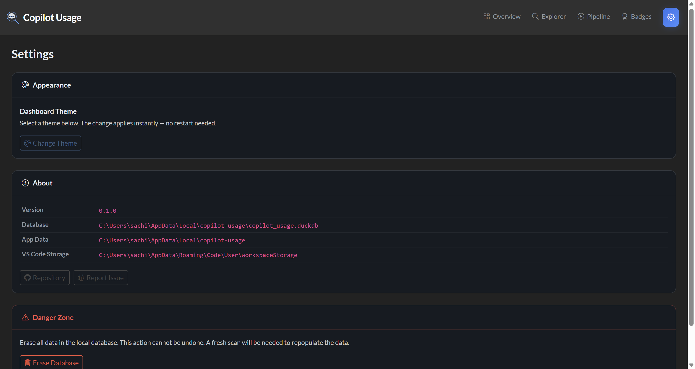

# Copilot Usage Analytics

A **local-first** analytics dashboard that parses your VS Code Copilot chat session data and visualises token usage, premium request estimates, and model distribution — all without sending any data externally.


## Features

- **Incremental scanning** — Only parses new or changed JSONL files on each run
- **DuckDB storage** — Fast local analytical database, no server required
- **Premium request estimation** — Calculates costs based on GitHub's model multiplier table
- **Multi-page dashboard** — Overview with KPI cards and charts, plus a detailed Explorer page with search & filters
- **Per-workspace breakdown** — See which projects use the most tokens
- **Model distribution** — Visualise usage across GPT-4o, Claude, Gemini, and other models
- **Badge export** — Shields.io-compatible JSON badges for each workspace
- **Cross-platform** — Windows, macOS, and Linux

## Quick Start

### Install

```bash
pip install -e .
```

### Run

```bash
# Scan data and launch dashboard (default)
copilot-usage

# Scan only (no dashboard)
copilot-usage analyze

# Dashboard only (skip scan)
copilot-usage dashboard
```

The dashboard opens automatically at [http://127.0.0.1:8050](http://127.0.0.1:8050).

### CLI Options

| Flag | Description |
|------|-------------|
| `--port PORT` | Dashboard port (default: 8050) |
| `--no-browser` | Don't auto-open browser |
| `-v, --verbose` | Enable debug logging |

## Dashboard Pages

### Overview

The main page shows at-a-glance KPI cards, a daily token timeline chart, model distribution pie chart, and summary tables for workspaces and sessions.

### Explorer

A dedicated search & filter page where you can:

- **Search** by session ID, workspace, or model name
- **Filter** by date range, workspace, model, and minimum token count
- **Sort** results by any column
- Browse the full event-level detail


### Pipeline

Run the data ingestion pipeline directly from the dashboard with a real-time console output.


### Badges

Generate Shields.io-compatible JSON badges for your workspaces.


### Settings

Manage appearance (dark/light theme toggle), view system info, and erase the database.



## How It Works

1. **Discovery** — Finds all `chatSessions/*.jsonl` files in VS Code workspace storage
2. **Parsing** — Extracts session anchors, request metadata, and token counts from JSONL events
3. **Ingestion** — Writes structured events to a local DuckDB database with premium cost estimates
4. **Aggregation** — Pre-computes daily, per-session, and per-workspace summaries
5. **Dashboard** — Plotly Dash serves interactive charts and tables from the local database

## Data Source

The tool reads from VS Code's local storage:

| Platform | Path |
|----------|------|
| Windows | `%APPDATA%\Code\User\workspaceStorage\` |
| macOS | `~/Library/Application Support/Code/User/workspaceStorage/` |
| Linux | `~/.config/Code/User/workspaceStorage/` |

**No data leaves your machine.** Everything is processed and stored locally.

## Database

DuckDB database is stored at:

| Platform | Path |
|----------|------|
| Windows | `%LOCALAPPDATA%\copilot-usage\copilot_usage.duckdb` |
| macOS | `~/Library/Application Support/copilot-usage/copilot_usage.duckdb` |
| Linux | `~/.local/share/copilot-usage/copilot_usage.duckdb` |

## Model Multipliers

Premium request estimates use GitHub's published multiplier table:

| Model | Multiplier |
|-------|-----------|
| GPT-4.1, GPT-4o, Claude Sonnet 4, Gemini 2.5 Flash | 0× (included) |
| O4-mini, Gemini 2.5 Pro, Claude Sonnet 4 Thinking | 1× |
| Claude Opus 4.6, O3 | 3× |

## Project Structure

```
src/copilot_usage/
├── __main__.py        # CLI entrypoint
├── config.py          # Paths, model multipliers
├── db.py              # DuckDB schema & connection
├── discovery.py       # JSONL file discovery
├── parser.py          # JSONL parsing
├── ingest.py          # Event ingestion
├── aggregator.py      # Pre-aggregation
├── pipeline.py        # Scan orchestrator
├── badges.py          # Shields.io badge export
└── dashboard/
    ├── app.py         # Dash multi-page app
    ├── assets/        # CSS & favicon
    ├── pages/
    │   ├── overview.py    # KPI + charts page
    │   ├── explorer.py    # Search & filter page
    │   ├── pipeline.py    # Pipeline runner page
    │   ├── badges.py      # Badge generator page
    │   └── settings.py    # Settings & DB management
    └── queries.py     # Read-only DB queries
```

## Requirements

- Python ≥ 3.10
- VS Code with GitHub Copilot Chat extension

## License

Apache 2.0 — see [LICENSE](LICENSE).
